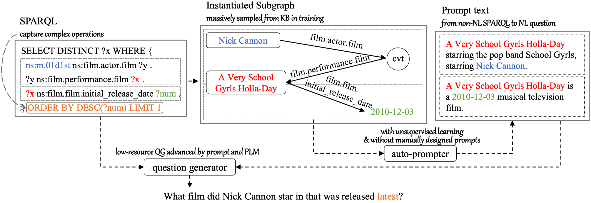

# AutoQGS


This repository contains the code for CIKM 2022 paper "AutoQGS: Auto-Prompt for Low-Resource Knowledge-based Question Generation from SPARQL"

<div align="center">

[](https://doi.org/10.1145/3511808.3557246)
[](https://arxiv.org/abs/2208.12461)

</div>

This figure illustrates the overall process.

<div align="center">
  
</div>


## Environment Setup

- Install dependencies

```bash
pip install -r requirements.txt -U
export PYTHONPATH=`pwd`:$PYTHONPATH
```
- Start ES

```bash
# 1. Download Wikipedia dump, unzip to `enwiki-20181220/wiki_raw`
python preprocess_bart/es_clean_data.py
# 2. Insert Wikipedia to ES
python preprocess_bart/es_insert.py
```

- Start Freebase

Following the [instructions](https://github.com/dki-lab/Freebase-Setup), start Virtuoso server at port 8890.

## Preprocess datasets & Prepare training data

The processed dataset is available at: [WQCWQ1.1_KGQG.tar.gz](dataset/WQCWQ1.1_KGQG.tar.gz) and [PathQuestion_KGQG.tar.gz](dataset/PathQuestion_KGQG.tar.gz). But the training data is not included.

Download:
- [WebQuestionsSP](https://www.microsoft.com/en-us/download/details.aspx?id=52763)
- [ComplexWebQuestions V1.1](https://www.tau-nlp.sites.tau.ac.il/compwebq)
- [PathQuestion](https://github.com/zmtkeke/IRN)

The datasets should be placed in `datasets` folder:

```
datasets/wqcwq/WebQSP.train.json
datasets/wqcwq/WebQSP.test.json

datasets/wqcwq/ComplexWebQuestions_train.json
datasets/wqcwq/ComplexWebQuestions_dev.json

datasets/PathQuestion/{PQ-2H|PQ-3H|PQL-2H|PQL-3H|PQL-3H_more}.txt
```

Run the following scripts to preprocess the datasets.

```bash
python preprocess_bart/wqcwq_step1.py
python preprocess_bart/wqcwq_step2.py
python preprocess_bart/wqcwq_step3.py

python preprocess_bart/pathquestion_step1.py
python preprocess_bart/pathquestion_step2.py
```

## Method

Run distant supervised training and inference:
```bash
python main/run_ds_bart.py -c config/DS-desc/ds-wqcwq-simple-pathQ-desc-pattent.yml
```

Process the output of distant supervised training and prepare for few-shot training:
```bash
python preprocess_pmt/wqcwq_combine_beams_patt.py
python preprocess_pmt/pathq_combine_beams_patt.py
```

Run few-shot training, inference and evaluation:
```bash
python main/run_pmt_bart.py -c config/wqcwq/few-shot-v2/s0-sparql-nodesc/bart-0.1%-full-v01.yml
```


## Citation

```bibtex
@inproceedings{Xiong-AutoQGS-CIKM-2022,
    author = {Xiong, Guanming and Bao, Junwei and Zhao, Wen and Wu, Youzheng and He, Xiaodong},
    title = {AutoQGS: Auto-Prompt for Low-Resource Knowledge-based Question Generation from SPARQL},
    year = {2022},
    isbn = {9781450392365},
    publisher = {Association for Computing Machinery},
    address = {New York, NY, USA},
    url = {https://doi.org/10.1145/3511808.3557246},
    doi = {10.1145/3511808.3557246},
    abstract = {This study investigates the task of knowledge-based question generation (KBQG). Conventional KBQG works generated questions from fact triples in the knowledge graph, which could not express complex operations like aggregation and comparison in SPARQL. Moreover, due to the costly annotation of large-scale SPARQL-question pairs, KBQG from SPARQL under low-resource scenarios urgently needs to be explored. Recently, since the generative pre-trained language models (PLMs) typically trained in natural language (NL)-to-NL paradigm have been proven effective for low-resource generation, e.g., T5 and BART, how to effectively utilize them to generate NL-question from non-NL SPARQL is challenging. To address these challenges, AutoQGS, an auto-prompt approach for low-resource KBQG from SPARQL, is proposed. Firstly, we put forward to generate questions directly from SPARQL for KBQG task to handle complex operations. Secondly, we propose an auto-prompter trained on large-scale unsupervised data to rephrase SPARQL into NL description, smoothing the low-resource transformation from non-NL SPARQL to NL question with PLMs. Experimental results on the WebQuestionsSP, ComlexWebQuestions 1.1, and PathQuestions show that our model achieves state-of-the-art performance, especially in low-resource settings. Furthermore, a corpora of 330k factoid complex question-SPARQL pairs is generated for further KBQG research.},
    booktitle = {Proceedings of the 31st ACM International Conference on Information \& Knowledge Management},
    pages = {2250–2259},
    numpages = {10},
    keywords = {low resource, knowledge graph, complex question generation},
    location = {Atlanta, GA, USA},
    series = {CIKM '22}
}
```